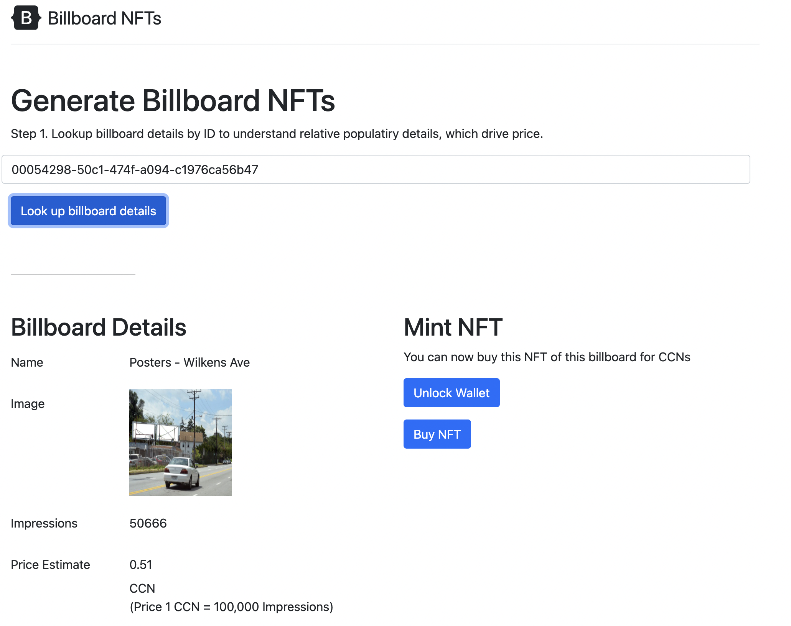

# NFTs Enablement of Physical Advertising Commerce

This is the final project for Columbia University final project ELENE 6883 Blockchain class by Andrei Oprisan (ao2775).



The code structure is as follows:
```
index.html - static HTML file to allow for basic concept demo and wallet interaction.
contracts - core smart contracts are here. BillboardNFT.sol smart contract allows for NFT minting and ID increments.
migrations - migration files
scripts - deploy and NFT minting scripts
transct.js - simple smart contract execution trigger, takes the smart contract ID and wallet ID with a transaction value and allows for contract execution.
```

## Steps to run:

```
1. Enter private env values in .env
2. Install packages (npm install)
3. Compile contract (truffle compile)
4. Deploy contract to a network (truffle migrate --network huygens; npx hardhat compile; npx hardhat run --network huygens scripts/deploy.js)
6. Set smart contract ID in index.html billboard_nft_smart_contract_id value and in transact.js key billboard_nft_smart_contract_id value from step 4, and billboard_purchaser_from_user_account (from browser console echo "provider.account") and billboard_purchase_amount from user interaction steps from web app. 
6. Run transaction script (node transact.js) once values are replaced. This will run our contract ID from a user account wallet for a specific amount.
```

## Review what we did:
```
1. We wrote a Smart Contract for BillboardNFT to get minted with equivalent deployment script.
2. We built a web app that looks up billboard details and calculates a price in CCN and get Ale Wallet details for NFT smart contract execution.
3. We built transaction processing script that allows for the contract we built to get executed against a wallet from address and a specified amount.
```
